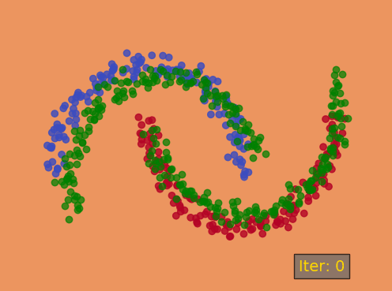

# Sliced Wasserstein Discrepancy for Unsupervised Domain Adaptation in PyTorch
This is a PyTorch re-implementation of [CVPR 2019](http://cvpr2019.thecvf.com) paper [Sliced Wasserstein Discrepancy for Unsupervised Domain Adaptation](https://arxiv.org/abs/1903.04064) from Apple. The [original code](https://github.com/apple/ml-cvpr2019-swd) by paper authors is implemented in Tensorflow.

If you find this repository helpful, please consider to cite the original paper. [[Paper]](https://arxiv.org/abs/1903.04064)

## Introduction
This repository aims to reproduce the results presented in the official repository. Thus, only a basic implementation on [intertwining
moons 2D dataset](https://scikit-learn.org/stable/modules/generated/sklearn.datasets.make_moons.html) is provided here. 

## Requirements
* Python 3.x
* Pytorch
* matplotlib

This code is tested under Ubuntu 16.04 with Python 3.6 and PyTorch 1.1.0. A GPU is not demanded to run this code.

## Running the code
To run the demo with adaptation:
```
python swd.py -mode adapt_swd
```

To run the demo without adaptation:
```
python swd.py -mode source_only
```

## Interpreting Outputs
Outputs will be saved as png and gif files in the current folder for each mode.
The outputs show the source and target samples with the current decision boundary.
&nbsp;<br />


## Acknowledgement
[ml-cvpr2019-swd](https://github.com/apple/ml-cvpr2019-swd) (Official implementation in Tensorflow)
